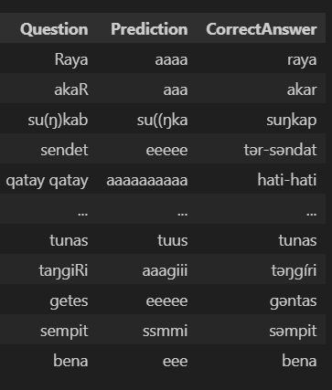

# Predict how the Proto-Austronesian word would look like from a Malay word

\*Proto-Austronesian is conventionally abbreviated to "PAn"

---

Table of Content

## Crawl dataset from Trussel2

`crawl_trussel2.ipynb` grabs the cognate dictionary from the amazing https://www.trussel2.com/ACD/ .

Then organize it into a csv of

```csv
, pan, malay
1, aba, aba-h
2, abaŋ, abaŋ-an
.
.
.
1823,zutzut	,jonjot (secondary prenasalization)
```

named `pan2malay.csv` in the `res` folder

## Encode string

I was certain with encoding character by character from the beginning, since I'm only translating(if you'd even call it that) from 1 word to 1 word. So the problem becomes how to make each character special.

I settled with one-hot encoding. Simply get a set of any character used in the dataset and one-hot encode it.

So the way I did it was turn the set into a list, this gives me an index for each character. Then I made an identity matrix, and assign each character their own row.

```
a 1 0 0 ... 0
ŋ 0 1 0 ... 0
ə 0 0 1 ... 0
.       .   0
.        .  0
.         . 0
D 0 0 0 ... 1
```

Take something like _"malam"_, which means "night". We find the indices of _m_, _a_, _l_, _a_ and _m_, grab that row from identity, and stitch them together!

```
m 1 .............. 0
a 0 .. 1 ......... 0
l 0 ......... 1 .. 0
a 0 .. 1 ......... 0
m 1 .............. 0
```

But there's a little issue here. You see, all the input must be the same shape. Yet ours change along with the length of the word. So before this, I actually pad the space character to the left until it reaches `WORD_MAX_LEN`, which is just a length I'm sure long enough to hold any word in my corpus.

And to decode just take where the largest number in the guess is and use that as the index. Like so:

```
[0.1, 0.05, 0.2 ... 0.9 ... 0.15]
                    ↑ get the index
mapping[that index]
```

## Model

While training I experimented with PAn→Malay, after a friend mentioned to me that some features just goes missing in a daughter language. For example PAn _C_ and _t_ both turn into _t_ in Malay, there would've been no way for the AI to make a good guess only knowing the Malay word has a _t_.

### Treat as 2D image

Local features would affect eachother, for example if a proto word looks like _"anbil"_ it may turns into _"a**m**bil"_ from the _b_ after. I thought treating it like a 2D image might allow it to capture these features.

My model:

```python
model = keras.Sequential()
model.add(keras.Input(shape=(WORD_MAX_LEN, len(encoder_mapping), 1)))
model.add(keras.layers.Dropout(0.3))
model.add(keras.layers.Conv2D(8, (3,3), activation="relu", padding="same"))
model.add(keras.layers.Conv2D(8, (3,3), activation="relu", padding="same"))
model.add(keras.layers.Conv2D(8, (3,3), activation="relu", padding="same"))
model.add(keras.layers.Conv2D(1, (3,3), activation="sigmoid", padding="same"))
model.compile(optimizer='adam', loss='binary_crossentropy', metrics=['accuracy'])
model.summary()
```

The results:



My theory is that the convolutions actually blurred the word. For example the prediction for _"qatay qatay"_ is _"aaaaaaaaaa"_. I think the feature of "having a lot of _a_" just picked up.

Conclusion:

Did not work.

At better results it just copied the input over, apparently Malay words often look similar enough to PAn words. I tried to stop this by adding a dropout layer so that it would get more loss if it just copied. Doesn't seem to have helped.

I tried different activation functions, different loss functions and all that. Only seemed to have gotten worse.
